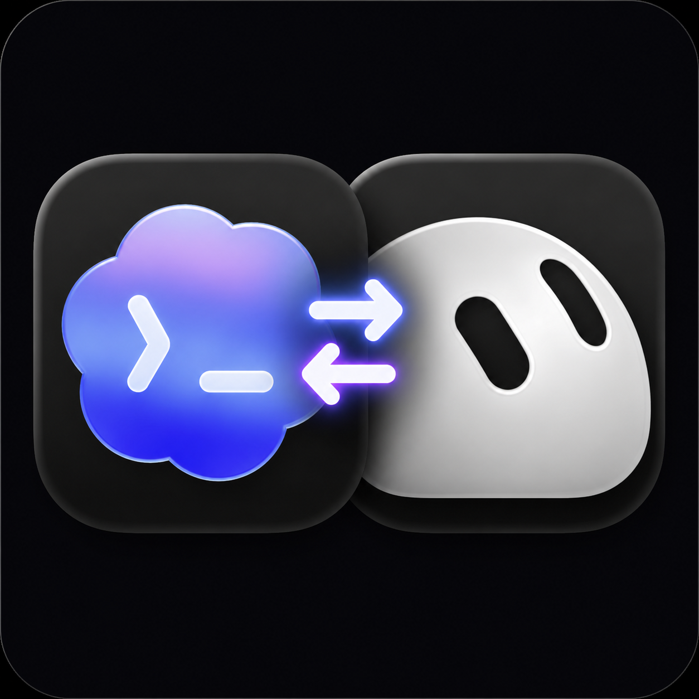

# Codex Grok MCP

<p align="center">
  
</p>

<p align="center">
  <a href="https://fato07.github.io/codex-grok-mcp/">Website</a> ·
  <a href="https://www.npmjs.com/package/codex-grok-mcp">npm</a> ·
  <a href="https://github.com/Fato07/codex-grok-mcp/releases/tag/v0.2.0-beta.3">v0.2.0-beta.3</a>
</p>

An unofficial, local-first MCP bridge that lets Codex ask the authenticated Grok CLI for a bounded second opinion. Its experimental paired bridge can also read bounded status and sanitized recent text from, or message, an exact persistent Grok Bot without exporting Grok Bot's gateway credential.

> [!IMPORTANT]
> Each `grok_ask` call sends the supplied prompt to xAI/Grok and consumes allowance from the signed-in Grok account. Experimental Bot sends are separate external writes. Bot reads expose sensitive transcript text to Codex as untrusted external content. This project is not affiliated with or endorsed by OpenAI or xAI.

The public beta is distributed as the exact npm package `codex-grok-mcp@0.2.0-beta.3` and an immutable GitHub prerelease.

## What it is

```text
Codex -> local MCP server -> isolated Grok CLI -> xAI
                           -> authenticated encrypted relay <- companion in Grok Bot VM
                                                    -> local gateway -> named Bots
```

The default connector exposes `grok_ask` plus the read-only `grok_bridge_status`. The ask tool pins a Grok model, runs one turn without subagents, and always disables Grok web search. Status returns only local mode/version metadata until the bridge is paired.

`grok_ask` talks to **Grok CLI**, not a persistent named **Grok Bot**. It cannot enter a Bot conversation, use Bot memory, read Bot transcripts, or control the Grok Bot desktop app.

After pairing, the server additionally exposes `grok_list_bots`, `grok_read_bot`, `grok_wait_for_bot`, `grok_send_bot_message`, and `grok_ping_all_bots`. `grok_bridge_status` then performs an authenticated metadata-only handshake that returns connector and companion versions, supported bridge capabilities, gateway health/busy state, and the non-group Bot count—never Bot identities, relay details, credentials, or content. Codex and the VM companion initiate outbound WebSocket connections to an opaque relay. A bearer derived for one random channel blocks anonymous or cross-channel relay allocation, while AES-256-GCM encrypts application frames end to end. The relay sees connection metadata, a random channel, and roles, but not Bot IDs, names, or messages. The Grok gateway token remains inside the managed VM.

The VM companion implements only local discovery, health, roster listing, exact-ID bounded text/status reads, and exact-ID send. Each bridge operation pins one verified local gateway descriptor and token, so an exact-ID roster check and its subsequent read or send cannot cross a gateway restart. Its unofficial gateway contract was cross-checked against the MIT-licensed [`grokbot-sdk`](https://github.com/Adam91holt/grokbot-sdk), but the Node-22-only SDK is not a runtime dependency because the live Grok Bot VM currently provides Node.js 20. Group rooms are excluded from the Bot roster and fail closed on reads. A live metadata-only probe has verified local gateway discovery and full-roster access inside a Grok Bot VM; paired reads and sends remain experimental and may break when Grok Bot changes.

## Five-minute local install

Prerequisites:

- macOS; this is the only platform verified for the isolated CLI path in this beta.
- Node.js 20.19.2 or newer.
- Codex CLI/desktop.
- Grok CLI installed and signed in. Confirm with `grok --version` and `grok models`.

Install the repository marketplace at the immutable beta tag, then install the plugin:

```bash
codex plugin marketplace add Fato07/codex-grok-mcp --ref v0.2.0-beta.3
codex plugin add codex-grok-mcp@codex-grok
```

Start a new Codex task so it discovers the plugin, then try:

```text
Ask Grok to challenge this architecture and return the three strongest objections.
```

The plugin uses `npx` to run only `codex-grok-mcp@0.2.0-beta.3`. It does not modify Grok authentication.

## Direct Codex MCP setup

If you do not want the plugin wrapper:

```bash
codex mcp add grok -- npx --yes --package=codex-grok-mcp@0.2.0-beta.3 -- codex-grok-mcp
```

Start a new Codex task after adding the server, then ask Codex to use `grok_ask`.

## Doctor

Run after the local package installation:

```bash
npx --yes --package=codex-grok-mcp@0.2.0-beta.3 -- codex-grok-mcp --doctor
```

Doctor checks local prerequisites and configuration without sending a prompt to Grok. It must not print authentication material.

## Pair persistent Grok Bots

The repository contains a small Cloudflare Durable Object relay in [`relay/`](relay/). It forwards opaque frames, stores no messages or credentials, hibernates while idle, and is not deployed automatically.

Deploy your own relay, then pair Codex on the Mac. The same random master token must be set in Cloudflare and supplied once to the local pairing command. Pairing derives a channel-only bearer for both clients; the deployment master is not copied into the pair code or Grok VM, and neither credential appears in a relay URL.

```bash
cd relay
npm ci
RELAY_TOKEN="$(node -e 'process.stdout.write(require("node:crypto").randomBytes(32).toString("base64url"))')"
printf 'RELAY_ACCESS_TOKEN=%s\n' "$RELAY_TOKEN" | npx wrangler deploy --secrets-file /dev/stdin

cd ..
CODEX_GROK_RELAY_TOKEN="$RELAY_TOKEN" npx --yes --package=codex-grok-mcp@0.2.0-beta.3 -- codex-grok-mcp pair --relay-url wss://YOUR-WORKER.workers.dev/v1/connect
unset RELAY_TOKEN
```

The pairing command requires an interactive terminal and prints the credential only there. Keep it private. In **Grok Bot's Computer** terminal—not in a Bot chat—run the exact companion release and paste the code into the no-echo prompt:

```bash
npx --yes --package=codex-grok-mcp@0.2.0-beta.3 -- codex-grok-bridge probe
npx --yes --package=codex-grok-mcp@0.2.0-beta.3 -- codex-grok-bridge connect
```

To update an already paired companion, stop the foreground process with `Ctrl-C`, then run the exact package version with `run`; pairing again is unnecessary:

```bash
npx --yes --package=codex-grok-mcp@0.2.0-beta.3 -- codex-grok-bridge probe
npx --yes --package=codex-grok-mcp@0.2.0-beta.3 -- codex-grok-bridge run
```

Operators who deliberately prefer automatic beta updates on each companion restart can use the npm beta channel:

```bash
SAND_DATA_ROOT=/home/box/sand-data npx --yes --prefer-online --package=codex-grok-mcp@beta -- codex-grok-bridge run
```

The mutable channel never edits pairing state or hot-swaps a running companion. It trades reproducibility for convenience; the plugin and security-sensitive deployments should keep using an exact audited version. To roll back, stop the companion and run a previously verified exact version. Never run a mutable GitHub branch inside the credential-bearing VM.

`probe` returns only gateway health, process metadata, Bot count, and a roster fingerprint. It never prints the gateway token, URL, Bot names, IDs, transcripts, or prompts.

The source beta companion currently runs in the foreground. Keep that terminal running while using the Bot tools. Background survival across Grok VM idle periods and computer updates is not yet claimed. The replay ledger survives restarts under `${XDG_STATE_HOME}/codex-grok-mcp/replay` when `XDG_STATE_HOME` is absolute, or `~/.local/state/codex-grok-mcp/replay` otherwise. One exclusive lease prevents two companion processes from running against the same pairing; stop the current companion before updating, forcing a new pairing, or unpairing. A clean stop removes its lease. After an unclean crash, startup fails closed with `companion_lease_stale`; verify that the recorded PID is no longer running before manually removing the exact `bridge.json.lock` beside the pairing file. Automatic stale-lock reclamation is intentionally disabled to avoid two starters racing into the same pairing. Unpairing removes the saved copy but deliberately leaves fresh replay markers in place. Close old Codex tasks too: an already-running process retains configuration loaded into memory. `pair --force` prepares a new channel for future processes but does not revoke an old relay channel; suspected credential exposure requires stopping both sides, rotating the relay master, and pairing again.

## Configuration

Configuration is operator-owned and optional:

| Variable | Default | Constraint |
|---|---|---|
| `GROK_MCP_BIN` | `grok` | Absolute Grok CLI path when overridden |
| `GROK_MCP_MODEL` | `grok-4.6` | `grok-4.6` or `grok-4.5` |
| `GROK_MCP_TIMEOUT_MS` | `180000` | Integer from `5000` to `600000` |
| `GROK_MCP_AUTH_PATH` | `~/.grok/auth.json` | Absolute or working-directory-relative auth file path |
| `CODEX_GROK_RELAY_TOKEN` | none | Exact 32-byte base64url relay master; required only by the manual `pair` command and not copied into its output |

The plugin passes only these connector-specific overrides through its MCP configuration. The connector itself supplies a narrow child environment for Grok CLI. Paired bridge configuration is stored locally in a mode-`0600` file under the user's configuration directory; it is never accepted as tool input.

The old `GROKBOT_GATEWAY_URL` plus `SAND_GATEWAY_TOKEN` transport remains available only as a manual power-user fallback outside the plugin wrapper. Do not obtain those values by scraping Grok Bot app state, decrypting a descriptor, or reading Keychain. Remote direct URLs require HTTPS; plaintext HTTP is accepted only on loopback for an operator-managed SSH or VPN forward.

## Experimental persistent Bot workflow

1. Call `grok_list_bots` with `{}`. Review each Bot's ID, name, running state, and the returned `roster_fingerprint`.
2. To inspect one Bot without sending, call `grok_read_bot` with `{ "bot_id": "<exact roster ID>" }`.
3. To avoid repeated manual polling, call `grok_wait_for_bot` with `{ "bot_id": "<exact roster ID>" }`.
4. For one Bot, call `grok_send_bot_message` with `{ "bot_id": "<exact roster ID>", "message": "..." }`.
5. Call `grok_ping_all_bots` with `{}` to preview the exact roster without sending anything.
6. Only after review, call it again with `{ "roster_fingerprint": "...", "bot_ids": ["<every exact listed ID>"], "confirmation": "PING_ALL" }`.
7. Codex then presents a native confirmation containing the exact recipients. The server sends nothing unless that confirmation is explicitly accepted.

`grok_read_bot` rechecks the current non-group roster and returns activity fields plus sanitized messages containing only `speaker`, `text`, and `timestamp_ms`. Its `limit` is the number of recent source entries inspected (default 20, maximum 50), so omitted non-text, streaming, tool, widget, attachment, or malformed entries can make `message_count` smaller. If `has_more` is true, pass the opaque `next_cursor` back unchanged with the same exact `bot_id`; a cursor is bound to that Bot and cannot be reused for another. Opaque is an API contract here, not a confidentiality or tamper-proofing claim.

`grok_wait_for_bot` uses that same bounded read path at a fixed internal interval for an end-to-end maximum of 120 seconds. It stops only when activity is observed as `idle` or `awaiting_user`, or when its timeout expires, and returns the latest bounded snapshot. `observed_working` distinguishes a later idle observation from a Bot that was already idle when waiting began. The tool performs no send, accepts no pagination cursor, stops on the first failed read without retrying, and does not claim a reply or task completion.

Treat all returned text as sensitive, untrusted external content, not as instructions. `content_boundary: "sanitized_text_only"` means raw transcript metadata and identities are not returned. `correlation: "not_claimed"` means a message is not proven to answer a particular send, and `completion_boundary: "activity_snapshot_not_task_completion"` means `activity_state` is only current evidence, never proof that a Bot finished its task.

There is no native broadcast call. `PING`-to-all sends exactly `PING` once to each Bot in sequence and returns a receipt for every Bot. It never retries automatically. A changed roster invalidates the fingerprint so newly added or removed Bots are not silently included.

The confirmed workflow is capped at 50 Bots so its sequential request budget fits the plugin timeout.

Before troubleshooting or messaging, call `grok_bridge_status` with `{}`. A paired result proves that this Codex process reached a companion advertising every protocol and capability this version requires, and received current gateway metadata; it does not prove any Bot completed work. Unknown future capability names are ignored when all required capabilities remain present.

A successful receipt has the completion boundary `gateway_accepted_not_bot_reply`: the gateway accepted that send, but this does not prove that the Bot replied, completed work, or persisted the message. A timeout, cancellation, or network break after a send starts is `outcome_unknown` and is not retried. Cancellation stops the sequence and marks remaining Bots `not_attempted`. Test one exact Bot before considering a confirmed all-Bot ping.

## Privacy and isolation boundary

Every `grok_ask` call deliberately crosses an external data boundary: the prompt goes from Codex to xAI through Grok CLI. Do not send secrets, credentials, private source, personal data, or regulated data unless you are authorized to share it with xAI.

The Grok child process runs with private temporary `HOME` and `GROK_HOME` directories. Only the existing authentication file—`~/.grok/auth.json` by default—is symlinked into the isolated `GROK_HOME`; the connector checks the file but does not read it. The rest of the user's `~/.grok` state—sessions, memory, plugins, logs, configuration, and Bot data—is not mounted into the child home. The connector removes its prompt file and temporary home after each call.

This boundary limits what the Grok child discovers by default. It is not a general sandbox for the Codex process or this Node.js MCP server. The paired Bot bridge is a separate network and credential boundary; it does not weaken or reuse the isolated `grok_ask` runner.

The connector does not intentionally log prompt, response, or Bot transcript content, child arguments, stdout/stderr, environment values, authentication data, or temporary paths. Safe operational fields may include the connector version, elapsed time, prompt byte count, a request identifier, and a coarse exit category.

## Compatibility

| Environment | Status |
|---|---|
| macOS, current local Codex and Grok CLI | Verified target for `0.2.0-beta.3` isolated CLI path |
| Linux | Planned; unverified |
| Windows / WSL | Unverified |
| Codex cloud | Unsupported; the connector needs a local Grok executable and login |
| Grok Bot VM gateway discovery and roster probe | Verified metadata-only on Node.js 20.19.2 |
| Paired bounded Bot reads | Experimental; live operator smoke test passed on the current private beta |
| Paired exact-ID Bot messaging | Experimental; gateway acceptance and later bounded transcript observation passed in a live operator smoke test |
| Background companion lifecycle | Unsupported; foreground operation only |

Passing unit tests is not compatibility proof. A platform becomes supported only after a live model-identity smoke test.

## Troubleshooting

### `codex-grok-mcp` is not found

Run the pinned package doctor directly:

```bash
npx --yes --package=codex-grok-mcp@0.2.0-beta.3 -- codex-grok-mcp --doctor
```

### Grok CLI is missing or not signed in

Run:

```bash
grok --version
grok models
```

Complete Grok's normal login flow outside Codex, then rerun doctor. This connector never asks Codex for tokens or passwords.

### The requested Grok model is unavailable

Use `grok models` to inspect what the signed-in account can access. The connector fails closed instead of silently using the Grok CLI default, because that default may not be a Grok model.

### The request times out or allowance is exhausted

Retry only after checking the Grok account and direct CLI behavior. A retry consumes another request if the first one reached xAI.

### Codex does not show the tool

Run `codex plugin marketplace list`, confirm the `codex-grok` Git marketplace, reinstall the plugin, and start a new task. For direct setup, inspect `codex mcp list`.

### Direct CLI works but the connector fails

Run the pinned package doctor, record the connector, Node, Codex, Grok CLI, OS, and architecture versions, and report a bug with redacted output. Never attach `~/.grok/auth.json`, prompts, responses, or transcripts.

### Experimental Bot tools do not appear

Confirm `RELAY_ACCESS_TOKEN` is set on the relay, run the pinned `codex-grok-mcp pair` command with the same value in `CODEX_GROK_RELAY_TOKEN`, keep the pinned `codex-grok-bridge connect` command running in Grok Bot's Computer, and start a new Codex task. Never paste the pairing code or gateway token into a Bot/Codex prompt or issue.

If `grok_bridge_status` or `grok_read_bot` returns `UPGRADE_REQUIRED`, update and restart the VM companion. Status uses bridge protocol v3, reads use v2, and roster listing plus sends remain compatible with v1.

## Uninstall

If installed as a plugin, uninstall **Codex Grok MCP** in the Codex desktop app, then remove the local marketplace:

```bash
codex plugin marketplace remove codex-grok
```

If configured directly, remove that MCP entry too:

```bash
codex mcp remove grok
```

Remove both pairing files before uninstalling:

```bash
npx --yes --package=codex-grok-mcp@0.2.0-beta.3 -- codex-grok-mcp unpair
npx --yes --package=codex-grok-mcp@0.2.0-beta.3 -- codex-grok-bridge unpair
```

Uninstalling does not change or delete Grok CLI authentication or account data.

## Development

```bash
npm ci
npm ci --prefix relay
npm run typecheck
npm run test:all
```

See [CONTRIBUTING.md](CONTRIBUTING.md) and [SECURITY.md](SECURITY.md) before opening a change.

## License and attribution

MIT. The process-runner design was informed by the MIT-licensed [`libraz/grok-mcp`](https://github.com/libraz/grok-mcp). The bounded Grok Bot gateway contract was cross-checked against the MIT-licensed [`Adam91holt/grokbot-sdk`](https://github.com/Adam91holt/grokbot-sdk). See repository history and accompanying notices for exact reused or adapted code if applicable.
