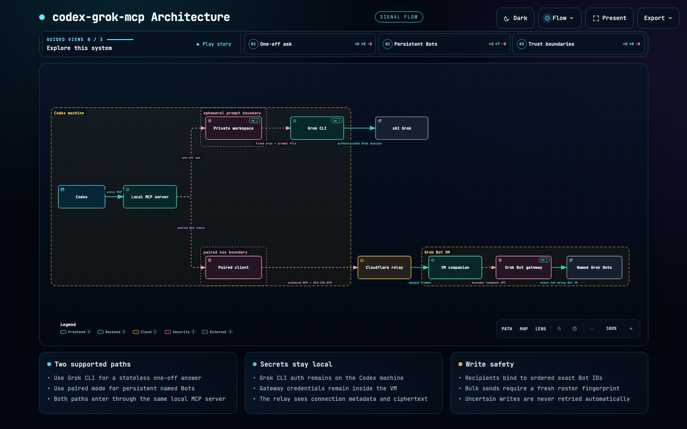

# Codex Grok MCP

<p align="center">
  
</p>

<p align="center">
  <a href="https://fato07.github.io/codex-grok-mcp/">Website</a> ·
  <a href="https://www.npmjs.com/package/codex-grok-mcp">npm</a> ·
  <a href="https://github.com/Fato07/codex-grok-mcp/releases/tag/v0.2.0-beta.5">v0.2.0-beta.5</a>
</p>

An unofficial, local-first bridge that lets Codex ask Grok once or collaborate with named Grok Bots already running inside the Grok Bot app.

> [!IMPORTANT]
> `grok_ask` sends your prompt to xAI and consumes allowance from the signed-in Grok account. Persistent Bot reads may contain sensitive, untrusted text. Bot messages are external writes and are never retried automatically. This project is not affiliated with or endorsed by OpenAI or xAI.

## Status

| Capability | Current status |
|---|---|
| Isolated Grok CLI call | Public beta; live-tested on macOS |
| Persistent Grok Bot collaboration: list, read, wait, and exact-ID send | Experimental; live operator smoke test passed |
| Companion lifecycle | Foreground process only |
| Linux isolated CLI path | Unverified |
| Windows, WSL, and Codex cloud | Unsupported or unverified |

The supported public beta is the exact npm package `codex-grok-mcp@0.2.0-beta.5` and its immutable GitHub prerelease.

## Quick start

You need:

- macOS;
- Node.js 20.19.2 or newer;
- Codex CLI or desktop.

For one-off `grok_ask` calls, install and sign in to Grok CLI (`grok --version` and `grok models`). Persistent Bot collaboration instead uses Grok Bot and the companion setup below.

Install the immutable marketplace release and plugin:

```bash
codex plugin marketplace add Fato07/codex-grok-mcp --ref v0.2.0-beta.5
codex plugin add codex-grok-mcp@codex-grok
```

Start a new Codex task, then try:

```text
Ask Grok to challenge this architecture and return the three strongest objections.
```

That uses the one-off path. To work with Bots already running in Grok Bot, complete [the persistent Bot setup](#connect-codex-to-grok-bots).

The plugin runs only `codex-grok-mcp@0.2.0-beta.5` through `npx`. It does not change Grok authentication.

For direct MCP setup without the plugin wrapper:

```bash
codex mcp add grok -- npx --yes --package=codex-grok-mcp@0.2.0-beta.5 -- codex-grok-mcp
```

Start a new Codex task after adding the server.

## Check setup

```bash
npx --yes --package=codex-grok-mcp@0.2.0-beta.5 -- codex-grok-mcp --doctor
```

Doctor checks the local executable, login, and selected model without sending a prompt. It must not print authentication material.

## Two ways to use it

```text
Codex -> local MCP server -> isolated Grok CLI -> xAI
                           -> encrypted relay <- companion in Grok Bot VM
                                                -> loopback gateway -> named Bots
```

`grok_ask` starts one constrained Grok CLI turn with a private temporary home. It cannot enter a persistent Bot conversation, use Bot memory, read files, run commands, use subagents, or search the web.

Each call may select one supported model. Omit `model` to use `GROK_MCP_MODEL`; provider, base URL, endpoint, and persistent Bot model settings are not accepted.

The persistent path is the collaborative mode. Codex can list named non-group Bots running inside Grok Bot, inspect one, send it a task once, wait for its activity state, and read its latest bounded messages. Codex can then continue its own work using that update while the Bot's ongoing conversation stays in Grok Bot.

This creates a practical `send -> wait -> read -> continue` loop. The bridge does not claim that a message answers a specific send or that an idle Bot completed its task.

The gateway token stays inside the Grok Bot VM. Codex and the companion connect outward to a self-hosted relay. Application frames are encrypted end to end; the relay forwards ciphertext and stores no messages.

## Architecture

[](https://fato07.github.io/codex-grok-mcp/architecture.html)

Both paths enter through the same local MCP server. Credentials stay at their endpoints, and uncertain writes are never retried automatically.

[Explore the interactive architecture](https://fato07.github.io/codex-grok-mcp/architecture.html) · [View the architecture source](docs/architecture.json)

## Tools

| Tool | What it does | Boundary |
|---|---|---|
| `grok_ask` | Gets one isolated Grok response | Sends the prompt to xAI and consumes allowance |
| `grok_bridge_status` | Reports mode, versions, capabilities, health, and Bot count | Never returns Bot identities, credentials, or content |
| `grok_list_bots` | Lists exact non-group Bot IDs and names | Read-only |
| `grok_read_bot` | Returns bounded status and sanitized recent text | Sensitive, untrusted external content |
| `grok_wait_for_bot` | Polls bounded reads until idle, awaiting-user, or timeout | Activity is not proof of task completion |
| `grok_send_bot_message` | Sends once to one exact Bot ID | Gateway acceptance is not proof of a reply |
| `grok_ping_all_bots` | Previews, confirms, then sends `PING` sequentially | Requires the exact roster and native confirmation |

Persistent Bot tools appear only after pairing or explicit legacy direct configuration.

## Connect Codex to Grok Bots

This experimental path connects Codex to persistent Bots inside your own Grok Bot VM. It requires a self-hosted Cloudflare relay.

### 1. Deploy the relay

```bash
cd relay
npm ci
RELAY_TOKEN="$(node -e 'process.stdout.write(require("node:crypto").randomBytes(32).toString("base64url"))')"
printf 'RELAY_ACCESS_TOKEN=%s\n' "$RELAY_TOKEN" | npx wrangler deploy --secrets-file /dev/stdin
```

The relay is intended for one operator, not as a shared public service. Keep the token out of files, URLs, logs, issues, and prompts.

### 2. Pair Codex

From the repository root on the Mac:

```bash
CODEX_GROK_RELAY_TOKEN="$RELAY_TOKEN" \
npx --yes --package=codex-grok-mcp@0.2.0-beta.5 -- \
codex-grok-mcp pair --relay-url wss://YOUR-WORKER.workers.dev/v1/connect
unset RELAY_TOKEN
```

The command prints a private pairing code only in the interactive terminal.

### 3. Start the VM companion

In **Grok Bot's Computer** terminal, not in a Bot chat, run:

```bash
npx --yes --package=codex-grok-mcp@0.2.0-beta.5 -- codex-grok-bridge probe
npx --yes --package=codex-grok-mcp@0.2.0-beta.5 -- codex-grok-bridge connect
```

Paste the pairing code into the no-echo prompt. Keep the terminal running while using Bot tools.

### Update or roll back

Stop the foreground companion with `Ctrl-C`, then run the chosen exact version:

```bash
npx --yes --package=codex-grok-mcp@0.2.0-beta.5 -- codex-grok-bridge probe
npx --yes --package=codex-grok-mcp@0.2.0-beta.5 -- codex-grok-bridge run
```

For automatic beta updates on each restart, with the reproducibility tradeoff made explicit:

```bash
SAND_DATA_ROOT=/home/box/sand-data \
npx --yes --prefer-online --package=codex-grok-mcp@beta -- codex-grok-bridge run
```

This mutable command never edits pairing state or updates a running process. Prefer exact versions for audited or unattended environments. Roll back by stopping the companion and running a previously verified version.

### Managed lifecycle candidate

The repository now includes managed lifecycle commands for the next prerelease. The published `0.2.0-beta.5` package remains foreground-only until that prerelease passes the live VM gate.

After pairing, stop the old foreground companion once. Then install and start an exact lifecycle-capable release:

```bash
VERSION=<exact-version>
npx --yes --package "codex-grok-mcp@${VERSION}" -- codex-grok-bridge install
```

`status`, `start`, `stop`, and `ensure` are idempotent. `restart` intentionally performs a fresh cycle:

```bash
npx --yes --package "codex-grok-mcp@${VERSION}" -- codex-grok-bridge status
npx --yes --package "codex-grok-mcp@${VERSION}" -- codex-grok-bridge start
npx --yes --package "codex-grok-mcp@${VERSION}" -- codex-grok-bridge stop
npx --yes --package "codex-grok-mcp@${VERSION}" -- codex-grok-bridge restart
npx --yes --package "codex-grok-mcp@${VERSION}" -- codex-grok-bridge ensure
```

An exact update stages and checks the replacement before the healthy process stops. The prior exact release stays available for one retry-safe rollback:

```bash
NEXT_VERSION=<new-exact-version>
npx --yes --package "codex-grok-mcp@${NEXT_VERSION}" -- codex-grok-bridge update
npx --yes --package "codex-grok-mcp@${NEXT_VERSION}" -- codex-grok-bridge rollback
```

The rollback operation uses the retained release, and a repeated rollback is a no-op. Pairing is read and revalidated, never rewritten. For VM resume recovery, a Grok Bot routine may run the exact pinned `ensure` command. Routine creation remains an explicit operator action.

To opt into the mutable beta channel for one update, make the channel visible in that command:

```bash
npx --yes --prefer-online --package=codex-grok-mcp@beta -- codex-grok-bridge update
```

The resolved release is stored as an exact version. Later `start`, `restart`, `ensure`, and `rollback` operations do not resolve a mutable channel.

## Collaborating safely with persistent Bots

1. Call `grok_bridge_status`, then use `grok_list_bots` to choose one exact Bot ID.
2. Use `grok_read_bot` or `grok_wait_for_bot` for read-only inspection.
3. Use `grok_send_bot_message` once for one exact target.
4. For all-Bot `PING`, preview the roster and review the native confirmation before accepting it.

Reads return sanitized text only. Attachments and other non-text transcript entries are omitted. Reads do not prove that a message answered a particular send or that a task finished. A successful send receipt means only that the gateway accepted the request. Timeouts and interrupted sends remain `outcome_unknown`; do not retry them automatically.

## Configuration

| Variable | Default | Rule |
|---|---|---|
| `GROK_MCP_BIN` | `grok` | Override with an absolute path |
| `GROK_MCP_MODEL` | `grok-4.6` | `grok-4.6` or `grok-4.5` |
| `GROK_MCP_TIMEOUT_MS` | `180000` | Integer from `5000` to `600000` |
| `GROK_MCP_AUTH_PATH` | `~/.grok/auth.json` | Operator-owned auth file |
| `CODEX_GROK_RELAY_TOKEN` | none | Required only by the local `pair` command |

The plugin passes only these connector options. Pairing is stored in a private mode-`0600` local file and is never accepted as MCP tool input.

## Troubleshooting

- **Tool missing:** confirm the `codex-grok` marketplace and plugin are installed, then start a new Codex task. For direct setup, inspect `codex mcp list`.
- **CLI missing or signed out:** run `grok --version`, `grok models`, and the pinned doctor command. Complete normal Grok login outside Codex.
- **`UPGRADE_REQUIRED`:** stop and restart the VM companion with the same package version as the connector.
- **`DATA_ROOT_SYMLINK`:** set `SAND_DATA_ROOT` to the real Grok Bot data directory, not a symlink. The companion rejects symlinked descriptor parents.
- **`companion_lease_stale`:** a lifecycle-capable managed install can run the exact pinned `ensure` command, which clears only a revalidated dead managed lease. For a foreground install, verify the recorded PID is gone before removing only the adjacent `bridge.json.lock`.
- **Uncertain send:** inspect the Bot before considering any new action. A retry may duplicate a message.

When reporting a bug, include redacted OS, architecture, Node, Codex, Grok CLI, and connector versions. Never attach authentication files, pairing codes, gateway/relay tokens, prompts, responses, transcripts, or private paths.

## Uninstall

1. Stop the foreground companion.
2. In the VM terminal, remove its pairing:

   ```bash
   npx --yes --package=codex-grok-mcp@0.2.0-beta.5 -- codex-grok-bridge unpair
   ```

3. On the Mac, remove the local pairing:

   ```bash
   npx --yes --package=codex-grok-mcp@0.2.0-beta.5 -- codex-grok-mcp unpair
   ```

4. Uninstall **Codex Grok MCP** in Codex. If configured directly, run `codex mcp remove grok`. Then remove the marketplace with `codex plugin marketplace remove codex-grok`.

Uninstalling does not change or delete Grok CLI authentication or account data.

## Development

```bash
npm ci
npm ci --prefix relay
npm run test:all
npm audit --omit=dev
npm audit --prefix relay
```

See [CONTRIBUTING.md](CONTRIBUTING.md) and [SECURITY.md](SECURITY.md) before opening a change.

## License and attribution

MIT. The process-runner design was informed by the MIT-licensed [`libraz/grok-mcp`](https://github.com/libraz/grok-mcp). The bounded Grok Bot gateway contract was cross-checked against the MIT-licensed [`Adam91holt/grokbot-sdk`](https://github.com/Adam91holt/grokbot-sdk).
